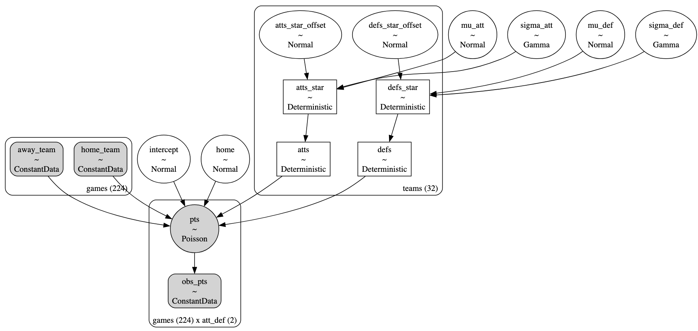
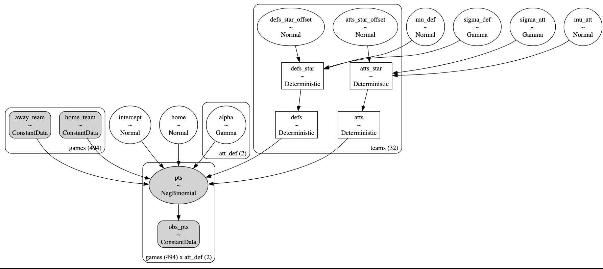
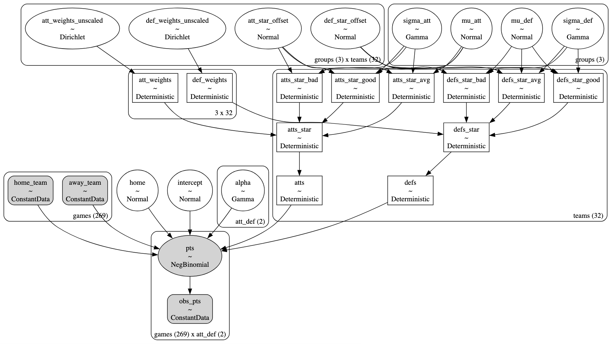

# The math behind `turf` 
---

## 0 - Abstract

`turf` is a Python package that fits Bayesian hierarchical Poisson or Negative Binomial regression models on the results of NFL or NHL games. These models infer home field advantage and the offensive and defensive strengths of the home and away teams from their past game results via Bayesian inference. Once the posterior distributions of model parameters has been inferred, samples drawn from the posterior can be used to simulate future games, estimate team strength of schedules, and quantify teams' offensive and defensive strengths, with uncertainties. Here, I detail the structure of the hierarcical models implemented in `turf`. All models are inspired by [Baio and Blangiardo (2010)](https://doi.org/10.1080/02664760802684177) in that they are log-linear Poisson (or Negative Binomial) regressions of home and away offensive and defensive performance fit on past results, i.e., home and away points. 

## 1 - Models

`turf` implements Bayesian hierarchical regression models conditioned on the number of points scored by home and away teams over games in a season. I assume the discrete point distributions follow Poisson or Negative Binomial distributions, depending on the model. The regressions are comprised of a sum of logged parameters including an intercept term, a attacking term from the given team, and a defensive term from the team's opponent. The home team gets an additional fixed effect in the regression to account for home-field advantage. Below, I describe each model I consider and the underlying mathematical structure.

### 1.1 - Independent Poisson

The first model we consider is similar to the model considered in Section 2 of [Baio and Blangiardo (2010)](https://doi.org/10.1080/02664760802684177). We assume the home and away points in the $i^{th}$ game, $y_{h,i}$ and $y_{a,i}$, respectively, are modeled as conditionally-independent Poisson random variables. A Poisson distribution is suitable for game scores as it models the probability of observing a number of events, like points, in a given time interval, like a game, assuming the variance ~ mean of the points distribution. This model is given by,

$$y_{h,i} | \theta_{h,i} \sim \mathrm{Poisson}(\theta_{h,i})$$

where $\theta_{h,i}$ is the scoring intensity for the home team in the $i^{th}$ game. The same quantities are modeled in the same way for the away team.

For each team and game, the log scoring intensities are given by

$$\log \theta_{h,i} = \mathrm{intercept} + \mathrm{home} + \mathrm{att_{h,i}} + \mathrm{def}_{a,i}$$

$$\log \theta_{a,i} = \mathrm{intercept} + \mathrm{att_{a,i}} + \mathrm{def_{h,i}}$$

where the intercept term gives the typical amount of points scored by the average team and home indicates the additional points the home team typically gets due to not having to travel, fans, potentially favorable referee opinions, and more. $\mathrm{att_{h,i}}$ and $\mathrm{def_{a,i}}$ represent the attacking and defensive ability of the home and away teams in the $i^{th}$ game, respectively. This formalism effectively enables us to account for how a team's offense and their opponent's defense interact, for both home and away teams. 

We assume the following priors for the intercept and home advantage random parameters

$$\mathrm{intercept} \sim \mathcal{N}(0,1)$$

$$\mathrm{home} \sim \mathcal{N}(0,1)$$

Individual team effects are model as exchangeable random variables sampled from a common parent distribution (hyperprior). We use the following non-centered variables

$$\mathrm{att_x} \sim \mu_{att} + \mathcal{N}(0,1) * \sigma_{att}$$

$$\mathrm{def_x} \sim \mu_{def} + \mathcal{N}(0,1) * \sigma_{def}$$

for att and def for the $i^{th}$ team.

Good teams have high att (+ scoring intensity) and low def parameters (- scoring intensity imposed on opponent). Bad teams display the opposite.

We enforce a "sum-to-zero" constraint

$$\sum_{x \in teams} \mathrm{att}_x = 0$$

$$\sum_{x \in teams} \mathrm{def}_x = 0$$

for parameter identifiability and interpretability.

The hyperpriors on the group attacking and defensive strengths are modeled as

$$\mu_{att} \sim \mathcal{N}(0, 1)$$

$$\mu_{def} \sim \mathcal{N}(0, 1)$$

$$\sigma_{att} \sim \mathrm{Gamma}(\alpha=2, \beta=0.1)$$

$$\sigma_{def} \sim \mathrm{Gamma}(\alpha=2, \beta=0.1)$$

for the means and standard deviations.

We use a hierarchical structure for this model by assuming that attacking and defensive strengths for each team are drawn from common parent distributions. We perform hierarchical Bayesian inference using `pymc` to infer posterior distributions for the parameters specified above. For more discussion on this type of model, see [Baio and Blangiardo (2010)](https://doi.org/10.1080/02664760802684177) and references therein. Below, we display the full `pymc` model graph.



### 1.2 - Negative Binomial

The second model we consider is similar in structure to the model considered in **Section 1.1**, but here, we assume an overdispersed  likelihood distribution where the points distribution variance > mean in general. The Negative Binomial distribution we use as the likelihood distribution effectively represents a Poisson random variable whose rate is Gamma distributed, reflecting the overdispersed nature of the points distribution. We assume the home and away points in the $i^{th}$ game, $y_{h,i}$ and $y_{a,i}$, respectively, are modeled as conditionally-independent Negative Binomial random variables. This model is given by,

$$y_{h,i} | \theta_{h,i} \sim \mathrm{NB}(\theta_{h,i}, \alpha_h)$$

where $\theta_{h,i}$ is the scoring intensity for the home team in the $i^{th}$ game. $\alpha_h$ is an additional hyperparameter that controls the degree of over dispersion for the home team's points as controlled by the NB variance = mean + mean$^2$ / alpha. The same quantities are modeled in the same way for the away team. 

I assume the following prior for each $\alpha_x$ term 

$$\alpha_{x} \sim \mathrm{Gamma}(\alpha=2, \beta=0.1)$$

for $x \in \{\mathrm{home}, \mathrm{away}\}$.

The rest of the model for computing the scoring intensities, $\theta_{x,i}$, and the assumed priors, hyperpriors, and model structure are exactly the same as **Section 1.1**. Below, we display the full `pymc` model graph.



### Negative Binomial with Groups

The third model we consider is similar in structure to the model considered in **Section 1.2**, but here, we assume that teams' attacking and defensive abilities are a weighted average of contributions from good, average, and bad skill groups with some group membership. We again model the home and away points in the $i^{th}$ game, $y_{h,i}$ and $y_{a,i}$, respectively, are modeled as conditionally-independent Negative Binomial random variables. This model is given by,

$$y_{h,i} | \theta_{h,i} \sim \mathrm{NB}(\theta_{h,i}, \alpha_h)$$

where $\theta_{h,i}$ is the scoring intensity for the home team in the $i^{th}$ game and $\alpha_h$ is an additional hyperparameter that controls the degree of over dispersion for the home team's points. The same quantities are modeled in the same way for the away team. 

I assume the following prior for each $\alpha_x$ term 

$$\alpha_{x} \sim \mathrm{Gamma}(\alpha=2, \beta=0.1)$$

for $x \in \{\mathrm{home}, \mathrm{away}\}$.

For each team and game, the log scoring intensities are given by

$$\log \theta_{h,i} = \mathrm{intercept} + \mathrm{home} + \mathrm{att_{h,i}} + \mathrm{def}_{a,i}$$

$$\log \theta_{a,i} = \mathrm{intercept} + \mathrm{att_{a,i}} + \mathrm{def_{h,i}}$$

where the terms were definied in **Section 1.1**.

Individual team effects are model as exchangeable random variables sampled from a weighted combination of parent distributions (hyperpriors). We use the following non-centered variables

$$\mathrm{att_{x,g}} \sim \mu_{att,g} + \mathcal{N}(0,1) * \sigma_{att,g}$$

$$\mathrm{def_{x,y}} \sim \mu_{def,g} + \mathcal{N}(0,1) * \sigma_{def,g}$$

for att and def for the $i^{th}$ team and group $g \in G = \{\mathrm{bad}, \mathrm{average}, \mathrm{good} \}$. The hyperpriors for each group $g$ are

$$\mu_{att} \sim \mathcal{N}([-1,0,1], 1)$$

$$\mu_{def} \sim \mathcal{N}([1,0,-1], 1)$$

$$\sigma_{att} \sim \mathrm{Gamma}(\alpha=2, \beta=0.1)$$

$$\sigma_{def} \sim \mathrm{Gamma}(\alpha=2, \beta=0.1)$$

where the good attacking group as a prior mean of 1 for the attacking intensity. All groups share the same form of attacking and defensive standard deviation hyperprior.

Each team's attacking and defensive strength are given as a weighted average of their bad, average, and good contributions with inferred weights $\pi$. We compute that weighted average as follows

$$ \mathrm{att}_x = \sum_{g \in G} \pi^{x,g}_{att} \mathrm{att}_{x,g} $$

$$ \mathrm{def}_x = \sum_{g \in G} \pi^{x,g}_{def} \mathrm{def}_{x,g} $$

for the $x^{th}$ team's attacking and defensive abilities. The weights for each team's attacking and defensive mixture weights for each skill group, e.g., $\pi^{x,g}_{att}$, are sampled from the Diriclet distributions

$$ \pi^{att}_x \sim \mathrm{Dirichlet}(1,1,1) $$

$$ \pi^{def}_x \sim \mathrm{Dirichlet}(1,1,1) $$

where we again enforce a "sum-to-zero" constraint

$$ \sum_{x \in teams} \mathrm{att}_x = 0 $$

$$ \sum_{x \in teams} \mathrm{def}_x = 0 $$

for parameter identifiability and interpretability.

Below, we display the full `pymc` model graph.



## 2 - Simulating a game

Below, I give code to run an inference on NHL data and simulate the outcome of an NHL game using the Negative Binomial mixture model.

```python
import pymc as pm
import numpy as np
from turf import scrape, inference

# Pull season results to-date
season = scrape.NHLSeason(year=2023)

# Initialize model
model = inference.IndependentNegativeBinomialMixture(season)

# Run inference on 4 cores (1 chain per core)
model.run_inference(tune=2000, draws=1000, 
                    target_accept=0.95, chains=4)

away_team = "STL"
home_team = "TBL"
ou = 6.5
hs = -1.5
n_most = 5

# Simulate n game outcomes
home_pts, away_pts, home_win, tie = model.simulate_game(home_team, away_team, n=10000,
                                                        seed=None,
                                                        tie_breaker_pt=True)

# Estimate, output prob of given bet
total = home_pts + away_pts
odds = np.mean(total > ou)
cover = np.mean(home_pts - away_pts > -hs)
home_ml = np.mean(home_pts > away_pts)
print(f"---{away_team} at {home_team}---")
print(f"O/U: {ou} - Over odds : {np.round(100*odds, decimals=2):.2f}%")
print(f"Spread: {home_team} {home_spread[ii]} - odds of {home_team} cover : {np.round(100*cover, decimals=2):.2f}%") 
print(f"ML: - odds of {home_team} ML : {np.round(100*home_ml, decimals=2):.2f}%")
print(f"Mean outcome: {away_team} {np.mean(away_pts):.1f} | {home_team} {np.mean(home_pts):.1f}")
print("")

# Output
# ---STL at TBL---
# O/U: 6.5 - Over odds : 52.13%
# Spread: TBL -1.5 - odds of TBL cover : 33.52%
# ML: - odds of TBL ML : 48.66%
# Mean outcome: STL 3.2 | TBL 3.5
```

## 3 - References

[Baio and Blangiardo (2010)](https://doi.org/10.1080/02664760802684177)